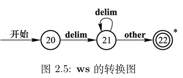

---
next:
    text: '返回原文'
    link: '/feature/archive/202511/1/content'
---

# [使用数据包制作编译器或解释器: 以C语言子集C-Minus为例](./content.md)

## 三、词法分析(Lexical Analysis)

### 3.2 准备工作

函数 `c-:init/`

```mcfunction
scoreboard objectives add c- dummy
scoreboard players set 10 c- 10
scoreboard players set -1 c- -1
```

函数标签 `minecraft:load`

```json
{
    "replace": false,
    "values": [
        "c-:init/",
        "c-:init/chr",
        "c-:init/operator",
        "c-:init/reserved",
        "c-:init/token"
    ]
}
```

#### 3.2.1 保留字识别

我们将准备用于保留字识别的计分板。
为完成保留字相关识别，我们首先需要一组函数提取现有词素。

函数 `c-:now-token/`

```mcfunction
execute store result storage c-: extract.0 int 1 run scoreboard players get #tok0 c-
execute store result storage c-: extract.1 int 1 run scoreboard players get #tok1 c-
return run function c-:now-token/_ with storage c-: extract
```

函数 `c-:now-token/_`

```mcfunction
$return run data modify storage c-: extract._ set string storage c-: code._ $(0) $(1)
```

本文上一稿使用的Python语言的保留字总共有35个，但本文使用的C-Minus语言在这方面极为精简，只有6个保留字。因此我们直接列出如下:

函数 `c-:init/reserved`

```mcfunction
scoreboard objectives add c-reserved dummy
scoreboard players set #if c-reserved -1
scoreboard players set #else c-reserved -2
scoreboard players set #while c-reserved -3
scoreboard players set #int c-reserved -4
scoreboard players set #void c-reserved -5
scoreboard players set #return c-reserved -6
```

使用以下函数进行保留字识别（固定传入参数为提取结果）:

函数 `c-:now-token/-`

```mcfunction
$return run scoreboard players get #$(_) c-reserved
```

### 3.2.2 运算符标识准备

我们将另取一个计分板存储各运算符的标识。
方便起见，所有单字符运算符的编码均与其ASCII码相同，此处不作重复登记。

同样，在C-Minus语言下，运算符的数量也很少。

函数 `c-:init/operator`

```mcfunction
scoreboard objectives add c-operator dummy
scoreboard players set #+= c-operator 70
scoreboard players set #-= c-operator 71
scoreboard players set #*= c-operator 72
scoreboard players set #/= c-operator 73
scoreboard players set #%= c-operator 74
scoreboard players set #!= c-operator 75
scoreboard players set #>= c-operator 76
scoreboard players set #<= c-operator 77
scoreboard players set #== c-operator 78
```

### 3.2.3 其他准备

我们将会为词素类型拟定编号，该编号用于词法分析取得词素后的返回（直接存储在玩家的c-token计分板中），列出如下:
（运算符和保留字的词素编号即上文其自身编号）

函数 `c-:init/token`

```mcfunction
scoreboard objectives add c-token dummy
scoreboard players set #end c-token 0
scoreboard players set #name c-token 1
scoreboard players set #number c-token 2
scoreboard players set #error c-token 127
```

另外，我们还将使用谓词解决一些在execute中判断可能大幅降低代码可读性的字符类型。
（也因此，我们选择利用玩家在计分板上的分数记录字符编码，而非另外创建虚拟玩家进行记录。）

谓词 `c-:digit` ([0-9])

```json
{"condition":"entity_scores","entity":"this","scores":{"c-chr":{"min":48,"max":57}}}
```

谓词 `c-:id_start` ([A-Za-z_], 以及其他可形成变量名的Unicode字符)

```json
{"condition":"any_of","terms":[
    {"condition":"entity_scores","entity":"this","scores":{"c-chr":{"min":65,"max":90}}},
    {"condition":"entity_scores","entity":"this","scores":{"c-chr":{"min":97,"max":122}}},
    {"condition":"entity_scores","entity":"this","scores":{"c-chr":{"min":127}}},
    {"condition":"entity_scores","entity":"this","scores":{"c-chr":94}}]
}
```

谓词 `c-:id_continue` ([0-9A-Za-z_], 以及其他可形成变量名的Unicode字符)

```json
{"condition":"any_of","terms":[
    {"condition":"reference","name":"c-:id-start"},
    {"condition":"reference","name":"c-:digit"}]
}
```

谓词 `c-:operator`

```json
{"condition":"any_of","terms":[
    {"condition":"entity_scores","entity":"this","scores":{"c-chr":{"min":33,"max":47}}},
    {"condition":"entity_scores","entity":"this","scores":{"c-chr":{"min":58,"max":64}}},
    {"condition":"entity_scores","entity":"this","scores":{"c-chr":{"min":91,"max":94}}},
    {"condition":"entity_scores","entity":"this","scores":{"c-chr":96}},
    {"condition":"entity_scores","entity":"this","scores":{"c-chr":{"min":123,"max":126}}}]
}
```

谓词 `c-:operator2` (能形成2字符运算符的字符。该谓词仅用于运算符部分的优化操作，去除不会影响运行。)

```json
{"condition":"any_of","terms":[
    {"condition":"entity_scores","entity":"this","scores":{"c-chr":37}},
    {"condition":"entity_scores","entity":"this","scores":{"c-chr":42}},
    {"condition":"entity_scores","entity":"this","scores":{"c-chr":43}},
    {"condition":"entity_scores","entity":"this","scores":{"c-chr":45}},
    {"condition":"entity_scores","entity":"this","scores":{"c-chr":47}},
    {"condition":"entity_scores","entity":"this","scores":{"c-chr":58}},
    {"condition":"entity_scores","entity":"this","scores":{"c-chr":60}},
    {"condition":"entity_scores","entity":"this","scores":{"c-chr":61}},
    {"condition":"entity_scores","entity":"this","scores":{"c-chr":62}}]
}
```

谓词 `c-:skip` ([ \t\n])

```json
{"condition":"any_of","terms":[
    {"condition":"entity_scores","entity":"this","scores":{"c-chr":9}},
    {"condition":"entity_scores","entity":"this","scores":{"c-chr":10}},
    {"condition":"entity_scores","entity":"this","scores":{"c-chr":13}},
    {"condition":"entity_scores","entity":"this","scores":{"c-chr":32}}]
}
```

### 3.3 正式开始实现词法分析器

词法分析和语法分析将在同一遍循环中完成。本文的实现中，使用语法分析器调用词法分析器获取词素。

词法分析器由一系列函数构成，这些函数通过互相调用的方式形成**确定的有限自动机**，每一个函数可以视为有限自动机的状态转换图上的一个节点。

识别完成后会将词素提交到语法分析器。

::: tip 注意
之后的函数中所有作为完整节点存在的函数都会存在注释以明确分类提示该节点执行的操作。
这些注释将划分每一个节点为4个部分: 对当前字符的计算(THIS)、读取下一个字符的计算或跳转(NEXT)、错误处理(ERROR)以及结束(END)。
即使一个节点没有其中的某一个或几个部分，相关注释仍然存在。
具体编写时，读者可以忽略这些注释。
:::
识别过程中将始终跟踪已识别词素的开头位置(`#tok0`)和结尾位置(`#tok1`)。
::: warning 注意
位置的存储与/data string的约定一致，即从0开始，前包含后不包含。
正在识别的字符在字符串的`#tok1`位置，但不会包含在已识别词素的范围内。
任何时候使用`/data ... string ... (#tok0) (#tok1)`将提取已识别词素。
:::

#### 3.3.1 识别开始

由于通常情况下能够决定上一个词素结束时下一个词素的第一个字符已经读入，不会在识别开始时再取得一个字符，而是从已经读入的字符开始。之后的每一个节点也遵循类似的结构，即先处理现在位置的字符，完成后再获取下一个字符并决定跳转。因此，整个词法分析过程开始时会先读入1个字符。

函数 `c-:lexical-analysis/start`

```mcfunction
data modify storage c-: code.0 set from storage c-: code._
function c-:next-char/
scoreboard players set #tok0 c- 0
scoreboard players set #tok1 c- 0
return run function c-:lexical-analysis/node/
```

词素的取得过程总是从有限自动机的开始状态节点开始。如果开始状态节点无法跳转至任何一个节点，其按照"文件尾"词素返回。

函数 `c-:lexical-analysis/node/`

```mcfunction
scoreboard players reset @s c-
scoreboard players operation #tok0 c- = #tok1 c-

execute if predicate c-:id-start run return run function c-:lexical-analysis/node/name
execute if predicate c-:digit run return run function c-:lexical-analysis/node/number
execute if predicate c-:operator run return run function c-:lexical-analysis/node/operator/
execute if predicate c-:skip run return run function c-:lexical-analysis/node/skip

scoreboard players operation @s c-token = #end c-token
```

词素的取得过程若出现错误，会调用以下函数显示错误信息，并向语法分析器返回"错误"词素使其终止工作。函数中预留了一些翻译键，方便错误消息调用当前词素、当前字符等信息。需要注意的是，语法分析器出现错误时也会使用该函数。

函数 `c-:terminate`

```mcfunction
function c-:now-token/
$tellraw @s {"translate":"$(msg)","color":"red","with":[{"storage":"c-:","nbt":"code.0"},{"storage":"c-:","nbt":"code.1"},{"storage":"c-:","nbt":"extract._"}]}
scoreboard players operation @s c-token = #error c-token
```

#### 3.3.2 变量名

- **参考正则表达式:** `[A-Za-z_][0-9A-Za-z_]*`
- 行为: 没有行为。
- 跳转: 若继续出现符合变量定义的字符则跳转至自身。
- 结束: 提取变量文本整体，尝试与保留字匹配并以变量名/保留字方式提交。


函数 `c-:lexical-analysis/node/name`

```mcfunction
# -- THIS --

# -- NEXT --
function c-:next-char/
execute if predicate c-:id-continue run return run function c-:lexical-analysis/node/name

# -- ERROR --

# -- END --
function c-:now-token/
execute store result score @s c-token run function c-:now-token/- with storage c-: extract
execute if score @s c-token matches 0 run scoreboard players operation @s c-token = #name c-token
```

#### 3.3.3 数字


大部分编程语言支持多种数字输入，如其他进制数、小数、指数甚至虚数，并且还可能使用下划线进行数字分隔。这导致数字输入所需节点数量变得很多，如笔者在实现上一稿的Python数字输入时使用了整整23个节点才完成，工作量可想而知。但由于C-Minus只输入十进制整数，因此只需要1个节点。

此处约定数字存储在玩家的`c-`计分板中。

**十进制整数节点**: 处理十进制整数（~~以及小数的整数部分~~）。

- **参考正则表达式:** `[0-9]+`
- 行为: 将已存储的数乘以10再加上新的一位数字。
- 跳转:
  - 若仍然是数字字符则跳转至自身。
  - ~~若是下划线则跳转至分隔符节点。~~
  - ~~若是小数点则跳转至小数开始节点。~~
  - ~~若是指数标记（Ee）则跳转至指数开始节点。~~
  - ~~若是虚数标记（Jj）则跳转至虚数节点（结束）。~~
- 错误: 若出现其他字符则报告"无效的十进制字面量"。
- 结束: 以整数形式提交。

函数 `c-:lexical-analysis/node/number`

```mcfunction
# -- THIS --
scoreboard players operation @s c- *= 10 c-
scoreboard players operation @s c- += @s c-chr
scoreboard players operation @s c- -= #0 c-chr

# -- NEXT --
function c-:next-char/
execute if predicate c-:digit run return run function c-:lexical-analysis/node/number

# -- ERROR --
execute if predicate c-:id-start run return run function c-:lexical-analysis/terminate {msg:"SyntaxError: invalid decimal literal"}

# -- END --
scoreboard players operation @s c-token = #number c-token
```

#### 3.3.4 运算符

运算符可能由1~2个符号共同构成。
有一些运算符必须通过下一个字符判断该运算符已经结束，而另一些运算符自身结构就已经决定了其可以直接结束，但仍需要进行获取下一个字符的操作以避免死循环。
另外，C-Minus语言使用C语言中由`/*`开头`*/`结尾的注释种类，因此需要在运算符部分提供入口。

函数 `c-:lexical-analysis/node/operator/`

```mcfunction
# -- THIS --
scoreboard players operation @s c-token = @s c-chr

# -- NEXT --
function c-:next-char/
execute if score @s c-token = #/ c-operator if score @s c-chr = #* c-chr run return run function c-:lexical-analysis/node/comment/
execute if predicate c-:operator2 if function c-:lexical-analysis/node/operator/_ run function c-:next-char/

# -- ERROR --

# -- END --
```

函数 `c-:lexical-analysis/node/operator/_`

```mcfunction
# 该函数属于节点 operator/ 的一部分，其自身不是节点函数。
execute if score @s c-token = #+ c-chr if score @s c-chr = #= c-chr run return run scoreboard players operation @s c-token = #+= c-operator
execute if score @s c-token = #- c-chr if score @s c-chr = #= c-chr run return run scoreboard players operation @s c-token = #-= c-operator
execute if score @s c-token = #* c-chr if score @s c-chr = #= c-chr run return run scoreboard players operation @s c-token = #*= c-operator
execute if score @s c-token = #/ c-chr if score @s c-chr = #= c-chr run return run scoreboard players operation @s c-token = #/= c-operator
execute if score @s c-token = #% c-chr if score @s c-chr = #= c-chr run return run scoreboard players operation @s c-token = #%= c-operator
execute if score @s c-token = #> c-chr if score @s c-chr = #= c-chr run return run scoreboard players operation @s c-token = #>= c-operator
execute if score @s c-token = #< c-chr if score @s c-chr = #= c-chr run return run scoreboard players operation @s c-token = #<= c-operator
execute if score @s c-token = #= c-chr if score @s c-chr = #= c-chr run return run scoreboard players operation @s c-token = #== c-operator
execute if score @s c-token = #! c-chr if score @s c-chr = #= c-chr run return run scoreboard players operation @s c-token = #!= c-operator
return 0
```

#### 3.3.5 注释

**注释节点**专门处理注释。由于注释退出需要`*/`两个字符，我们在此还会另外准备一个退出准备节点。

- **参考正则表达式:** `/\*.*\*/`
- 行为: 没有行为。注释不会提交至语法分析器。
- 跳转:
  - 检查到字符`*`则进入退出准备节点。
  - 或文件尾(`EOF`, 0)则按照分析错误退出处理。
  - 对于其他所有字符均跳转至自身。

函数 `c-:lexical-analysis/node/comment/`

```mcfunction
# -- THIS --

# -- NEXT --
function c-:next-char/
execute if score @s c-chr = #* c-chr run return run function c-:lexical-analysis/node/comment/end1
execute unless score @s c-chr matches 0 run return run function c-:lexical-analysis/node/comment/

# -- ERROR --
function c-:lexical-analysis/terminate {msg:"SyntaxError: unterminated comment"}

# -- END --
```

函数 `c-:lexical-analysis/node/comment/end1`

```mcfunction
# -- THIS --

# -- NEXT --
function c-:next-char/
execute if score @s c-chr = #/ c-chr run return run function c-:lexical-analysis/node/comment/end
execute if score @s c-chr = #* c-chr run return run function c-:lexical-analysis/node/comment/end1
execute unless score @s c-chr matches 0 run return run function c-:lexical-analysis/node/comment/

# -- ERROR --
function c-:lexical-analysis/terminate {msg:"SyntaxError: unterminated comment"}

# -- END --
```

函数 c-:lexical-analysis/node/comment/end

```mcfunction
# -- THIS --

# -- NEXT --
function c-:next-char/
return run function c-:lexical-analysis/node/

# -- ERROR --

# -- END --
```

#### 3.3.6 跳过

**跳过节点**处理需要被跳过的字符。C-Minus使用C语言的代码风格，忽略所有缩进与换行，所有语句使用分号分隔，代码块使用大括号分隔。



- **参考正则表达式:** `[ \t\r\n]+`
- 行为: 没有行为。跳过字符的类型与数量不影响语法分析。
- 跳转:
  - 若仍为可跳过的字符则跳转至自身。
  - 否则，跳转至根节点，从此处重新开始词素识别（包含文件尾）。

函数 `c-:lexical-analysis/node/skip`

```mcfunction
# -- THIS --

# -- NEXT --
function c-:next-char/
execute if predicate c-:skip run return run function c-:lexical-analysis/node/skip
return run function c-:lexical-analysis/node/

# -- ERROR --

# -- END --
```

