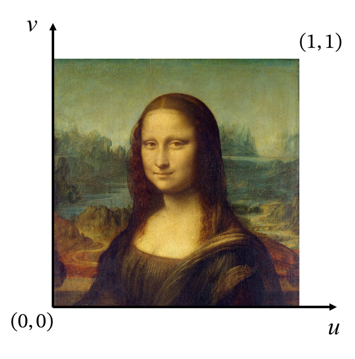
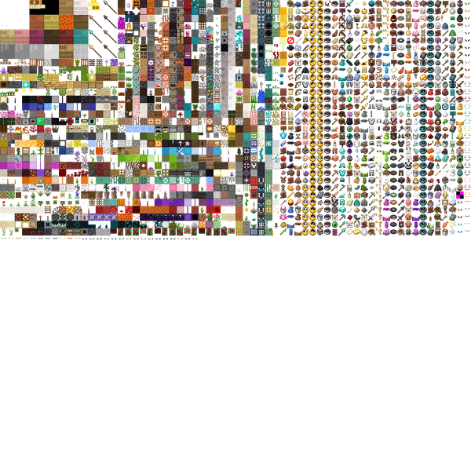
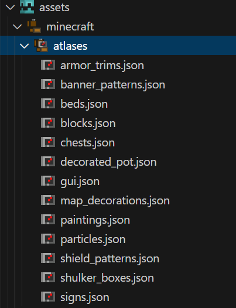
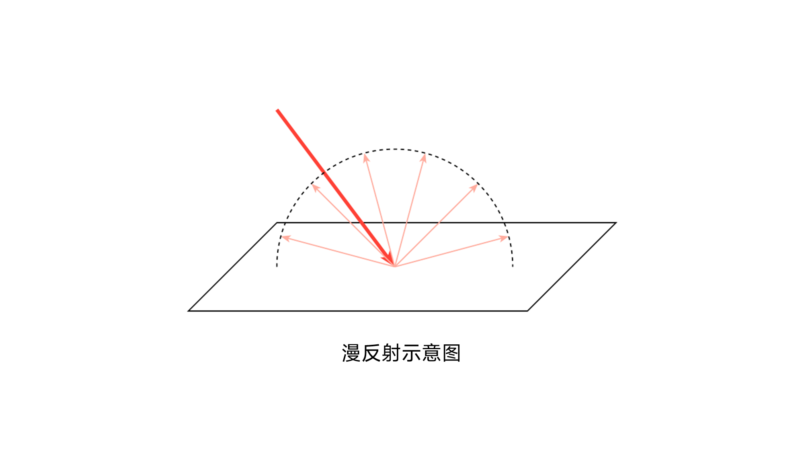
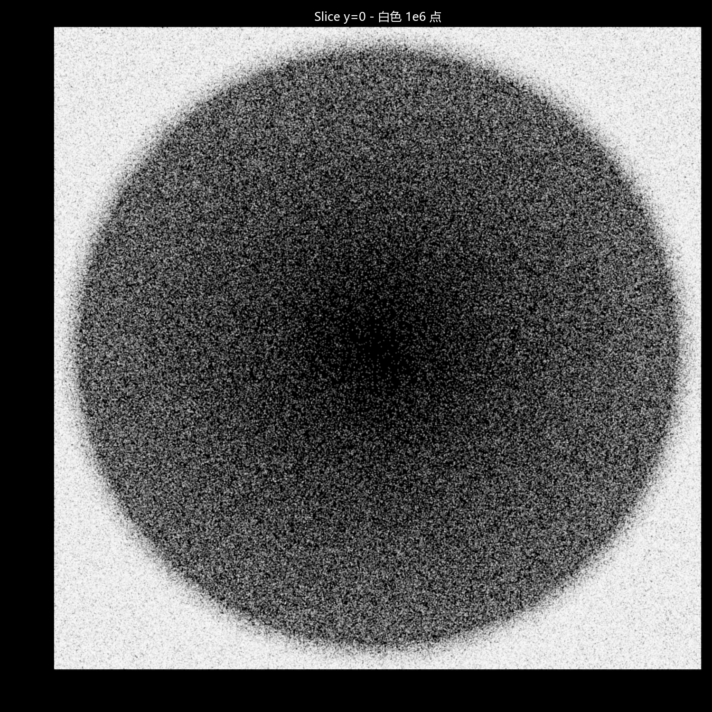

<FeatureHead
    title = '核心着色器的工作流程（下）'
    authorName = 轩宇1725
    avatarUrl = '../../_authors/轩宇1725.jpg'
    :socialLinks="[
        { name: 'BiliBili', url: 'https://space.bilibili.com/104432208' }
    ]"
    cover='../_assets/2.png'
/>

## 综述

前两篇文章以 Minecraft 中的着色器为基础，基本厘清了渲染管线的相关知识点，这些知识在其他的图形学领域基本是通用的。而本篇文章承接前两篇，对剩余更加体现 Minecraft 着色器特性的内容做了梳理和讲解，这一部分相当于学习 Minecraft的渲染管线设计，同时也串讲了一些图形学领域的通用概念。

## UV和纹理

### 采样

前几节对渲染过程的介绍中，有一个问题被避开不谈，那就是 —— 我们一直操作的是顶点和插值，那么渲染对象表面上丰富的纹理是如何产生的？这就涉及到我们要介绍的采样概念。

采样过程与 **采样器（Sampler）** 息息相关，在 OpenGL 中，一个采样器与一个 **纹理（Texture Unit）** 一一对应。纹理单元可以是一张贴图，也可以是物体表面的几何信息（如材质），亦可以是单纯的数据缓冲。

采样过程在 `vsh` 和 `fsh` 内都有使用，最常用的 GLSL 采样函数如下：

```glsl
vec4 texture(Sampler2D sampler, vec2 texCoord)
```

该函数需提供一个采样器和一个归一化的采样坐标，即 $(0.0, 0.0)$ 对应纹理单元的左下角，$(1.0, 1.0)$ 对应纹理单元的右上角。



函数返回一个归一化的颜色值，即rgba四个通道，每个分量的取值范围都在 $[0.0, 1.0]$ 之间。

```glsl
vec4 textureLod(Sampler2D sampler, vec2 texCoord, int Lod)
```

该函数与 `texture()` 类似，但允许用户手动指定 Lod，而 `texture()` 会自动选择 Lod 等级。

**Lod（Level of Detail，细节层次）** 是一种优化技术，在渲染不同距离的物体时，使用不同复杂度的纹理来采样，能够在保持视觉质量基本不变的情况下（在某些场景下甚至可能更好，比如消除摩尔纹），提升渲染的性能。

在纹理中，Lod 的控制是通过 **多级渐远纹理（Mipmap）** 实现的，Mipmap 是一系列以特定模式缩小的纹理。在离摄像头较远的片元中，单个片元就可以占有很大一片像素的信息，此时直接从更高等级的Mipmap中采样就能显著减少计算量，并且提升视觉效果。

<center style="color:gray;">


Mipmap示意图
</center>

::: tip 注

:::

使用`textureLod()` 指定Lod等级可以防止材质信息的损失，从而用于各种检测（会在后面的实践篇中用到）。

```glsl
vec4 texelFetch(Sampler2D sampler, ivec2 P, int Lod)
```

与上面的两个采样函数不同，`texelFetch()` 直接通过像素坐标从指定的Lod等级中获取像素信息，该函数通常不用于直接贴在模型表面的纹理，而是采集一些存储在纹理单元中的数据。

```glsl
vec4 textureProj(Sampler2D sampler, vec3 homoCoord)
vec4 textureProj(Sampler2D sampler, vec4 homoCoord)
```

这个函数并没有那么常用，不过它在 **末地传送门/折跃门** 方块的渲染中被使用，因此在这里也给出解析。

提供给该函数的坐标实际上是一个齐次坐标，在采样时会自动进行透视除法，即前两个分量除以最后一个分量，然后进行与 `texture()` 类似的采样。

### 纹理图集

为了减少对存储的访问，纹理是被事先载入到一张大的 **纹理图集（Texture Atlas）** 上的，其中每一个单元纹理被称为 **精灵图（Sprite）**。纹理图集就是与采样器一一绑定的纹理单元，UV就是在这张纹理图集上描述采样位置的坐标。

纹理图集的概念对一般的纹理作者可能比较陌生，直到 `1.19.3` 后纹理图集由资源包配置，部分作者才开始接触，但大多数纹理作者依旧不需要了解原理。但对于着色器作者来说，了解纹理图集的加载方式对进一步进行UV和纹理修改十分重要。

<center style="color:gray; background-color: #00000048; border-radius: 10px;">



1.21.10 原版中烘焙模型系统使用的纹理图集
</center>

::: tip 注
浏览文章时可能会发现插图下方有很大一片空白，那是因为这张atlas本来就这么大，它是一张正方形的图片。
:::

关于纹理图集的一些细节描述和定义格式在 [Minecraft Wiki - 纹理](https://zh.minecraft.wiki/w/%E7%BA%B9%E7%90%86?variant=zh-cn#%E7%BA%B9%E7%90%86%E5%9B%BE%E9%9B%86) 上已经详细介绍，这些内容不是我们讨论的重点。

但从纹理图集的定义可以看出，着色器中输入的 `UV/UV0` 和 `Sampler0` 不是一成不变的，而是被 **资源包中配置加入纹理图集的各个精灵图排序和尺寸** 决定。进一步地，可以看出 `UV/UV0` 的取值范围不是固定的（除非用在texture函数中，但与其他渲染过程相比，一般也不认为是固定的）。纹理图集的尺寸一定是2的整数次幂，但不会超过 $16384 \times 16384$。

因此，我们在纹理图集固定的情况下，是可以通过检查UV的数值来确定我们在渲染什么东西的。然而由于这种方案在不同情况下检查的值都不一样，因此这样设计的算法很可能不兼容任何其他的资源包甚至其他的游戏版本，一般不推荐使用。

::: warning 注意
纹理图集有多张，不同的纹理图集一般不会被发送到同一个渲染过程，因此着色器一般只能访问到当前渲染元素所属的纹理图集。
:::

### 基础纹理

**基础纹理（Base Texture）** 就是我们最熟知的一类纹理，直接存储在资源包的 `textures` 目录下，由 `atlases` 中的配置文件组合为不同的纹理图集。



基础纹理对应的采样器名称是 `Sampler0` 对应的采样坐标名称是 `UV` 或 `UV0`。由于此类纹理采样一般使用 `texture()` 函数进行采样，所以要求 `UV/UV0` 为归一化纹理坐标。而由于纹理图集的特性，渲染同一元素的同一面时，不能保证 `UV` 的值相同，而且一般整个面的取值只占区间 $[0,1]$ 的较小部分。

### 叠加层纹理

**叠加层纹理（Overlay Texture）** 用于实体受击变红的效果，不存储在资源包中。其对应的采样器名称是 `Sampler1` 对应的采样坐标名称是 `UV1`。

叠加层纹理是一张极小的纹理，总体上是下方为半透明红色，上方透明的位图。实体在受击时通过改变 `UV1` 的坐标从上方的透明值转移到下方的半透明红色值，与基础纹理混合后，就呈现了实体变红的效果。

::: warning 注意
这个采样器同时存在于一些根本不会受击的对象，如背包内的大部分方块与闪电苦力怕的电弧等。在这些着色器中这个采样器不发挥任何作用，但依然会进行采样。
:::

## 光照

::: danger 笔者注
怎么光照也被改了，下面的内容也是基于 1.21.8 编写的
:::

### 光照贴图

**光照贴图（Lightmap）** 是由着色器 `lightmap.fsh` 生成的一张纹理，同时输入作为绝大多数核心着色器的 `Sampler2` 渲染。

光照贴图的生成过程由数个不同的全局量决定。

- AmbientLightFactor: 环境光照因子，用于调整环境光对最终亮度的贡献强度。
- SkyFactor: 天空光照因子，与天空光照亮度乘算，调整天空光照的贡献强度。
- BlockFactor: 方块光照因子，与方块光照亮度乘算，调整方块光照的贡献强度。
- UseBrightLightmap: 是否使用高亮光照贴图，若为非0值，则会将原始光照颜色偏向青白色调，否则将会融合天空光照并暗化处理。  
- NightVisionFactor: 夜视因子，将光照颜色向更亮的方向混合
- DarknessScale: 黑暗缩放因子，降低颜色值，全局暗化
- DarkenWorldFactor: 暗化因子，用于混合原始颜色和暗化颜色
- BrightnessFactor: 亮度因子，控制最终的gamma矫正强度
- SkyLightColor: 天空光颜色

这些参数和时间、状态效果等都有关系，由于篇幅有限，这里不给出每个参数的定量解释，但会在未来的篇目中涉及，所以这里不需要理解各个变量的实际作用。

总之，光照贴图是一张随着环境而变化的贴图，这里给出一个典型的晚间光照贴图示例


光照贴图由 `texture()` 进行采样，横轴(u方向)为方块光照强度，纵轴(v方向)为天空光照强度。由于游戏内只有 $16$ 个光照等级 $(0, 1, \cdots, 15)$ ，且生成贴图时只有 $16 \times 16$ 个不同的颜色, 可以认为光照贴图的尺寸为 $16 \times 16$

值得注意的是, 光照贴图的采样是在 `vsh` 内完成的, 由下面的代码实现

```glsl
vec4 minecraft_sample_lightmap(sampler2D lightMap, ivec2 uv) {
    return texture(lightMap, clamp(uv / 256.0, vec2(0.5 / 16.0), vec2(15.5 / 16.0)));
}
```

### 光照混合（minecraft_mix_light）

光照混合函数是由包含着色器 `light.glsl` 提供的一个函数, 主要用于实体光照

```glsl
vec4 minecraft_mix_light(vec3 lightDir0, vec3 lightDir1, vec3 normal, vec4 color) {
    float light0 = max(0.0, dot(lightDir0, normal));
    float light1 = max(0.0, dot(lightDir1, normal));
    float lightAccum = min(1.0, (light0 + light1) * MINECRAFT_LIGHT_POWER + MINECRAFT_AMBIENT_LIGHT);
    return vec4(color.rgb * lightAccum, color.a);
}
```

```glsl
vertexColor = minecraft_mix_light(Light0_Direction, Light1_Direction, Normal, Color);
```

为了理解这个函数，我们需要介绍一些光照计算的理论

#### Lambert 余弦定律

Lambert余弦定律是描述理想漫反射表面或自发光体在空间中各方向辐射能量分布规律的基本定律，此类表面在任意观察方向上的辐射（或发光）强度与该方向和表面法线夹角 $\theta$ 的余弦值成正比 (本质上是界面的光辐照量)

从下图中可以直观地理解这个定律



光照射到此类表面后, 向四周反射相同强度的反射光, 那么反射光的强度只取决于这个表面接收到的光的强度


从图中可以看出，表面法线与光照方向的夹角为 $0$ 时，一定面积的表面接收到全部的光辐照量。而当夹角变为 $\displaystyle \frac{\pi}{3}$ 时, 一定面积接收到的辐照量只有原来的一半。基于几何推导则可得出Lambert, 光的辐照量与该方向和表面法线夹角 $\theta$ 的余弦值成正比.

```glsl
float light0 = max(0.0, dot(lightDir0, normal));
float light1 = max(0.0, dot(lightDir1, normal));
```

函数的前两行通过点乘操作得出了反射光的强度, 由于这里输入的光照方向和法向量都是单位向量，由向量点乘的定义 $\boldsymbol{v_1} \cdot \boldsymbol{v_2} = \|\boldsymbol{v_1}\|\|\boldsymbol{v_2}\| \cos <\boldsymbol{v_1},\boldsymbol{v_2}>$ , 这里 $\|\boldsymbol{v_1}\|, \|\boldsymbol{v_2}\|$ 都为 $1$, 因此点乘的结果就为两个向量之间的余弦值。

#### 光照的混合

光照的混合很简单, 就是各个参与贡献的光照强度之和, 这里游戏考虑了两类光照, 一共三束光。

```glsl
(light0 + light1) * MINECRAFT_LIGHT_POWER # 刚刚我们计算的反射光
MINECRAFT_AMBIENT_LIGHT # 环境光
```

光与物体表面交互时，反射的颜色为表面的基础颜色与光的颜色逐分量积，这里的颜色为白色，强度就是光照颜色。

```glsl
float lightAccum = min(1.0, (light0 + light1) * MINECRAFT_LIGHT_POWER + MINECRAFT_AMBIENT_LIGHT);
return vec4(color.rgb * lightAccum, color.a);
```

由于原版 Minecraft 中没有高光效果，当光照强度超过 1.0 时，会被取到 1.0，这就导致了最终渲染出的颜色不会比纹理中的原始颜色还亮。

最终, `minecraft_mix_light()` 的返回值将会作为顶点颜色，传入 `fsh` 中。

```glsl
vertexColor = minecraft_mix_light(Light0_Direction, Light1_Direction, Normal, Color);
```

## 雾气

::: danger 笔者注
孩子们我坠机了，现在是10月29日，mj昨天刚刚更改了雾气，下面的内容是按照 `1.21.8` 编写的
:::

作为上一节遗留的部分，我们接下来对原版着色器中雾气的渲染过程做详细的解析。

在1.21.8中，雾气主要由两部分组成：

- **球状雾（Spherical Fog）** ：等值面是球面，在近距离占主导。与环境相关。

- **柱状雾（Cylindrical Fog）**：等值面是圆柱面，在远距离占主导。与渲染距离相关。

下面是一个 desmos 可互动图表，可以让你查看两种雾气即最终渲染的雾气的等值面。

[Desmos Minecraft 1.21.8 Fog](https://www.desmos.com/3d/jocpvnusnm)

### fog.glsl

`fog.glsl` 是一个 **包含着色器** ，其中编写了一系列关雾气计算的函数。由于 Mojang 非常频繁地变更雾气计算，这里必须要明确示例的版本为 `1.21.8` ，其他版本下的 `fog.glsl` 很可能不同，但逻辑是相似的。

下面我们会逐一介绍该文件提供的各个函数是如何计算雾气的。这里先给出完整程序，现在不需要看懂，下面的内容我们回来解析这些函数的作用。

```glsl
#version 150

layout(std140) uniform Fog {
    vec4 FogColor;
    float FogEnvironmentalStart;
    float FogEnvironmentalEnd;
    float FogRenderDistanceStart;
    float FogRenderDistanceEnd;
    float FogSkyEnd;
    float FogCloudsEnd;
};

float linear_fog_value(float vertexDistance, float fogStart, float fogEnd) {
    if (vertexDistance <= fogStart) {
        return 0.0;
    } else if (vertexDistance >= fogEnd) {
        return 1.0;
    }

    return (vertexDistance - fogStart) / (fogEnd - fogStart);
}

float total_fog_value(float sphericalVertexDistance, float cylindricalVertexDistance, float environmentalStart, float environmantalEnd, float renderDistanceStart, float renderDistanceEnd) {
    return max(linear_fog_value(sphericalVertexDistance, environmentalStart, environmantalEnd), linear_fog_value(cylindricalVertexDistance, renderDistanceStart, renderDistanceEnd));
}

vec4 apply_fog(vec4 inColor, float sphericalVertexDistance, float cylindricalVertexDistance, float environmentalStart, float environmantalEnd, float renderDistanceStart, float renderDistanceEnd, vec4 fogColor) {
    float fogValue = total_fog_value(sphericalVertexDistance, cylindricalVertexDistance, environmentalStart, environmantalEnd, renderDistanceStart, renderDistanceEnd);
    return vec4(mix(inColor.rgb, fogColor.rgb, fogValue * fogColor.a), inColor.a);
}

float fog_spherical_distance(vec3 pos) {
    return length(pos);
}

float fog_cylindrical_distance(vec3 pos) {
    float distXZ = length(pos.xz);
    float distY = abs(pos.y);
    return max(distXZ, distY);
}
```

### 雾气上下文（Fog Context）

雾气依赖于一系列全局量来进行渲染，在 `1.21.8` 中，这些参数为:

- FogColor: 雾气颜色
- FogEnvironmentalStart: 环境雾气(球状雾)开始出现的距离
- FogEnvironmentalEnd: 环境雾气(球状雾)达到最大强度的距离
- FogRenderDistanceStart: 渲染距离雾气(圆柱状雾)开始出现的距离
- FogRenderDistanceEnd: 渲染距离雾气(圆柱状雾)达到最大强度的距离
- FogSkyEnd: 天空雾气达到最大强度的距离
- FogCloudsEnd: 云层雾气达到最大强度的距离

**球状雾（fog_spherical_distance）**

用于计算球状雾的距离变量由下面的函数给出

```glsl
float fog_spherical_distance(vec3 pos) {
    return length(pos);
}
```

即顶点距原点（摄像机）的距离，其等值面为球状

球状雾的 `End` 为定值 $1024$ ，`Start` 会因环境的不同而不同，比如失明、黑暗、浸入岩浆或水等，意味着不同环境下的球状雾其实距离并不相同，而直到 $1024$ 格外 (相当于 $64$ 个区块外) 达到最大。

**圆柱状雾（fog_cylindrical_distance）**

用于计算圆柱状雾的距离变量由下面的函数给出

```glsl
float fog_cylindrical_distance(vec3 pos) {
    float distXZ = length(pos.xz);
    float distY = abs(pos.y);
    return max(distXZ, distY);
}
```

其等值面为圆柱状

圆柱状雾的 `Start` 和 `End` 与客户端的渲染距离有关，`End` 为渲染距离的边界（即 $16 \times$ 渲染区块数），而 `Start` 为其 $90%$

这意味着圆柱状雾在近处完全没有贡献，而在渲染距离的边界迅速增大

下面是两种雾气叠加后的点云图截面，密度和强度正相关：




### 线性雾值（linear_fog_value）

每种雾的强度在其 `Start` 与 `End` 之间线性增加，在 `Start` 之前无强度，在 `End` 之后强度最大。由下面的函数计算得出

```glsl
float linear_fog_value(float vertexDistance, float fogStart, float fogEnd) {
    if (vertexDistance <= fogStart) {
        return 0.0;
    } else if (vertexDistance >= fogEnd) {
        return 1.0;
    }

    return (vertexDistance - fogStart) / (fogEnd - fogStart);
}
```


### 应用雾气（apply_fog）

一个点的雾气值最终取的是两种雾气中最强的，最终会以雾的浓度（雾气值与雾色透明度之积）为权，混合片元的颜色和雾的颜色，最终输出到颜色缓冲中。

```glsl
float total_fog_value(float sphericalVertexDistance, float cylindricalVertexDistance, float environmentalStart, float environmantalEnd, float renderDistanceStart, float renderDistanceEnd) {
    return max(linear_fog_value(sphericalVertexDistance, environmentalStart, environmantalEnd), linear_fog_value(cylindricalVertexDistance, renderDistanceStart, renderDistanceEnd));
}

vec4 apply_fog(vec4 inColor, float sphericalVertexDistance, float cylindricalVertexDistance, float environmentalStart, float environmantalEnd, float renderDistanceStart, float renderDistanceEnd, vec4 fogColor) {
    float fogValue = total_fog_value(sphericalVertexDistance, cylindricalVertexDistance, environmentalStart, environmantalEnd, renderDistanceStart, renderDistanceEnd);
    return vec4(mix(inColor.rgb, fogColor.rgb, fogValue * fogColor.a), inColor.a);
}
```

下面的图是两种雾叠加后的效果，颜色表示强度：


天空雾气和云层雾气使用的是同一套函数，仅修改了 `Start` 和 `End`，比较简单，所以这里不再解析。

## 总结

本节内容对着色器中大部分剩余的渲染工作做了梳理，除了一些较为特殊的着色器外，大部分的实体、方块渲染流程已经完整，现在读者应该了解一个实体或者方块是怎么由数据一步一步渲染出来的了。

对于采样，我们介绍了不同的采样器对应的内容，以及不同采样函数的使用方式和特性。对于光照，我们介绍了一些光照计算的理论，但并未给出光照贴图的生成原理。对于雾气，我们完整解析了 `1.21.8` 的计算过程，但未给出雾色的计算原理。

需要强调的一点是，对工作流程的介绍不要求读者能够完全理解中间的计算过程，因为很多参数是在游戏内部计算的，在着色器内并不透明。同时，目前也不要求读者能够自己创建自定义的渲染流程，但读者也可以去更改渲染流程中的一些关键参数，看看修改后会发生那些改变（如顶点在各个空间中的坐标、顶点的颜色等）。并且，该教程并不侧重于GLSL语言特性、语法以及线性代数的教学，这些内容非常重要，读者可以到遇到相关概念或问题的时候再去学，但我更建议先进行一定程度的系统性学习，对着色器（甚至是计算机图形学）的了解也会更进一步。

Minecraft 的着色过程其实还有非常多可讲的内容，由于此章节是关于工作流程的，故每个部分只大致给出了介绍。一些 **具体的、定量的计算内容** ，我们会放到原理篇（着色器工作流程是其中一部分）到实践篇的剩余篇幅中放到单篇详细介绍，包括末地传送门渲染、光照贴图的创建和参数影响因素、雾气颜色的参数影响因素等等。