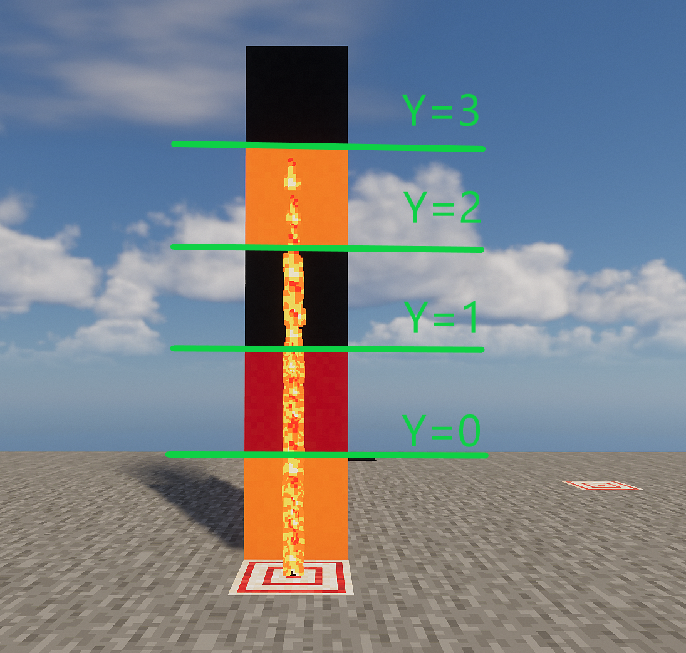
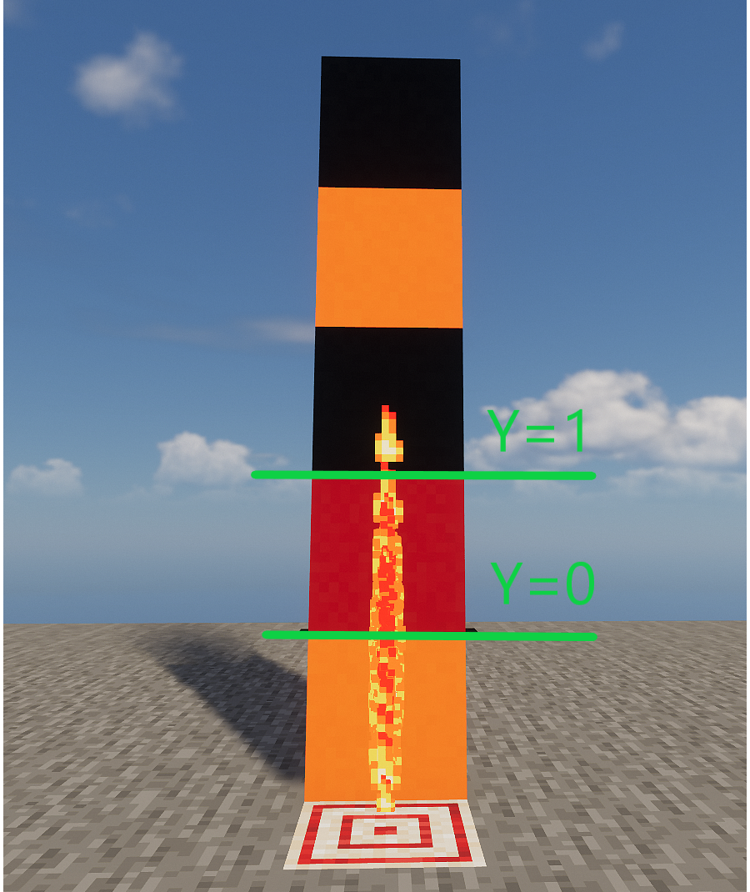

<FeatureHead
    title = '一种particle指令下的粒子定向发射方法与简单实例'
    authorName = Antares
    avatarUrl = '../../_authors/Antares.jpg'
    :socialLinks="[
        { name: 'BiliBili', url: 'https://space.bilibili.com/123178313' }
    ]"
    cover='../_assets/5.png'
/>

## 摘要

常规的 `/particle` 指令只能生成四处弥散的粒子，无法精确控制其运动方向。然而，我在1.12.2版本中发现当把粒子的数量参数设置为0时，游戏会将指令中的位置坐标与速度参数进行运算，并将结果直接转化为粒子的初始动量，并且这一机制在最新的快照25w45a中依旧存在。wiki上的“命令`/particle`”页面对这点虽然有所说明，但其内容并不符合游戏中实际发生的现象。本研究通过系统的测试与分析，清晰地揭示了该现象的核心原理。

## 引言

`/particle` 指令长期以来被认为只能生成无序弥散的视觉效果，其粒子运动方向具有随机性，无法被精确控制，这极大地限制了其在构建精密动画或交互体验方面的应用。现有社区资料（如Wiki）虽提及将粒子数量设置为零可能改变粒子行为，但其描述模糊且存在谬误，未能揭示其确切机制与稳定复现方法。接下来我将重新讲述`/particle` 指令的语法与参数并解释如何为粒子设置稳定、精确的飞行方向。该技术在原版基础上为命令开发者实现精密粒子效果提供了新的解决方案。

常规的 `/particle` 指令格式如下：

```mcfunction
particle <name> <pos> <delta> <speed> <count> [force|normal] [<viewers>]
```

我们将其拆分

```mcfunction
particle <粒子类型> <x> <y> <z> <xd> <yd> <zd> <速度> <数量> [<模式>] [<观看者>]
```

其中`<x>` `<y>` `<z>`三项即为`<pos>`，而`<xd>` `<yd>` `<zd>`三项为`<delta>`。
在通常使用情况中（数量选项不填或大于0）：
`<x>` `<y>` `<z>`决定粒子生成的基点，而`<xd>` `<yd>` `<zd>`决定粒子的扩散范围标准差，粒子将`<x>` `<y>` `<z>`为中心以延x、y、z三轴呈正态分布。
`<速度>`可以填入一个大于0的浮点数，通常他将决定粒子弥散的速率，但少部分粒子存在特殊情况，且相同的速度参数对不同粒子也会产生不同效果，在此不作赘述。
`<数量>`可填入一个大于等于0的整数，可以指定创造的粒子的数量，但当其值为0的时候仍然会产生一个粒子，这便是本文方法的关键。
`[<模式>]`可为force或normal，设置为normal将给32.0格以内的玩家显示粒子，设置为force将给512.0格以内的玩家显示粒子。
`[<观看者>]`则可限制能看到粒子效果的玩家。

## 粒子分布的理论与实际情况

在这里举一个例子做解释。

```mcfunction
particle minecraft:flame 0 0 0 0 1 0 0 100 force
```

上述指令将会在0，0，0生成100个flame粒子，他们将延y轴正态分布，1倍标准差为1格。
这意味着粒子将形成一条竖线，而50%粒子会分布在y=0以上，其中约68%将分布在y=±1之间，95%将分布在y=±2之间，而99.7%将分布在y=±3之间。在此范围外即三倍标准差之外，分布的概率极低，通常在数量不高的情况下可以认为粒子分布在该区域的情况是不会发生的。
理论上的分布情况：


我们在客户端中尝试执行该指令并观察：



我们可以看到其基本符合理论情况

那么想要生成一个在y轴分布在±1内的粒子，我们只需要让三倍标准差为1，即标准差约0.333。

```mcfunction
particle minecraft:flame 0 0 0 0 0.333 0 0 100 force
```



我们可以看到在该实例中发生了概率较小的情况，有一个粒子分布在三倍标准差外，但整体符合预期。

## 可控的定向粒子发射

### 动量方向实验

接下来我们察看wiki中关于[数量]为0时的描述。

::: warning wiki描述
若`<count>`为0，则在`<pos>`处生成单个粒子，将`<delta>`中的三个值分别乘上`<speed>`后作为三个参数传入粒子。
这意味着对于大部分接收参数的粒子，`<count>`设为0时，则令粒子从`<pos>`往`<delta>`的方向移动。
:::

按照wiki中叙述，当`<count>`设为0时，大部分粒子会从`<pos>`往`<delta>`的方向移动。我们不妨在游戏中进行测试。

```mcfunction
particle minecraft:flame 0 0 0 0 1 0 0.1 0 force
particle minecraft:flame 5 0 5 0 1 0 0.1 0 force
```

::: warning wiki描述
两条指令将分别在`(0,0,0)`和`(5,0,5)`处生成flame粒子并向`(0,1,0)`移动。
:::


然而实际上，在`(5,0,5)`处的粒子与`(0,1,0)`处粒子动量是完全一致的，均是向正上方。也就是说wiki上叙述并不正确。
经过多次的测试wiki中"令粒子从`<pos>`往`<delta>`的方向移动"除了在`(0,0,0)`处以外任何地点都不成立。

实际上`<pos>`与该情况下粒子动量方向没有任何关系，在这里粒子的动量方向仅仅与`<delta>`有关，无论粒子产生于何处始终其动量方向始终是从`(0,0,0)`指向`<delta>`的，因此上图中`(5,0,5)`处的粒子虽然处于`(5,0,5)`但仍沿着`(0,0,0)`到`(0,1,0)`的方向，即正上方运动。

那么我们便可以通过更改`<delta>`中数值指定我们的粒子发射方向了，但是其依然存在一定困难。如果我们仅仅需要生成一组固定的粒子可以提前设置好参数，但如果我们希望粒子向实体的某个方向发射时由于其以`(0,0,0)`为基点，我们很难在`<delta>`中引入`~ ~ ~`或`^ ^ ^`的表达式，便只能选择穷举或函数宏来解决。

而接下来我们将补齐本文粒子定向发射技术的最后一块拼图，消除世界原点 (`(0,0,0)`) 对速度方向的影响。
大致原理为我们通过execute positioned将指令执行点移动到极远处，如此一来实体所在位置与世界原点 (`(0,0,0)`)对于指令执行点来讲就几乎没有区别了，就如同在宇宙尽头（指令执行点）看向太阳(`(0,0,0)`)和看向地球（实体所在位置）一样，同时我们再将particle指令的pos填写与positioned相反的数值，如此一来粒子便产生于实体位置了，我们只需要在`<delta>`中填写`~ ~ ~`或者`^ ^ ^`便可以向实体相对方向发射粒子了。

不过你可能发现此时粒子似乎并不在运动甚至瞬间就消失了，这是因为`<delta>`中的三个值会分别乘上`<speed>`作为粒子动量大小，而此刻`<delta>`数值极大，我们只需要在`<speed>`中再填写一个很小的数值抵消其影响就可以了。

### 核心原理

接下来我将给出一个实例测试并具体分析:

```mcfunction
execute at @p positioned ^ ^ ^100000000 run particle minecraft:cloud ^ ^-1 ^-100000000 ^ ^ ^ 0.0000000099 0 force
```

该方案的核心原理：

+ 远距离执行：通过 execute positioned ^ ^ ^100000000 将指令执行点移动到极远处
+ 抵消原点影响：由于执行点极远，世界原点（`(0,0,0)`）对速度方向的影响可忽略不计
+ 建立局部方向：^ ^-1 ^-100000000 与 ^ ^ ^1 共同构建了从玩家视角前方指向远方执行点的方向向量
+ 微调速度：极小的速度值 0.0000000099 确保粒子运动平稳可见

所以该指令将在玩家^ ^-1 ^处生成一个向玩家面前发射的cloud粒子。即下图：


如此一来我们便实现了可控的定向粒子发射，该技术可以用于优化许多依赖实体的粒子效果，并很大程度提升粒子控制精度。同时也为自定义弹射物或其他高速tp实体粒子间断问题提供了新的解决方法，只需要让粒子带有与其运动方向相同大小合适的速度就可以大幅改善该问题。

## 参考文献

[1] <https://zh.minecraft.wiki/w/%E5%91%BD%E4%BB%A4/particle>


::: tip 编者注
使用自定义魔咒的`spawn_particles`实体效果组件也可以生成指定动量的粒子，其速度可以继承实体的速度，感兴趣的读者也可研究一下这种路线。
:::