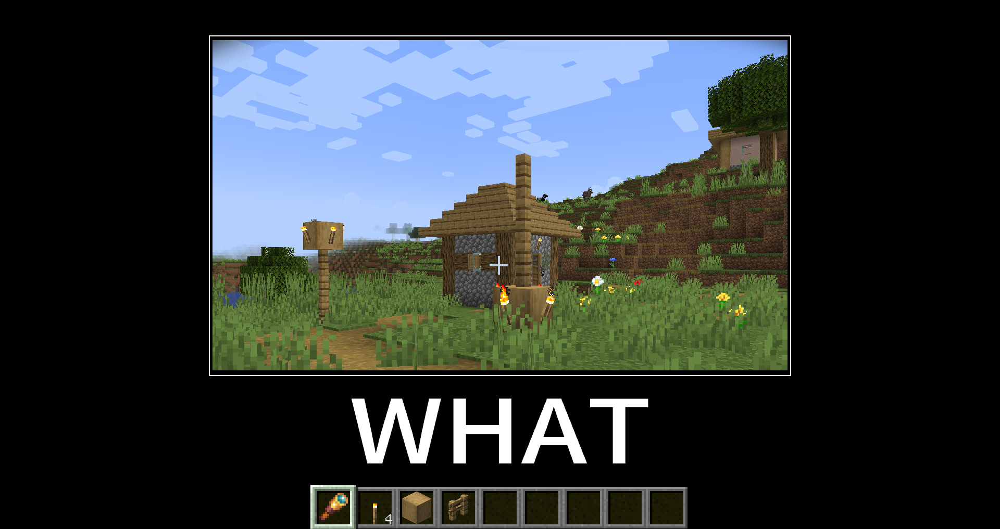
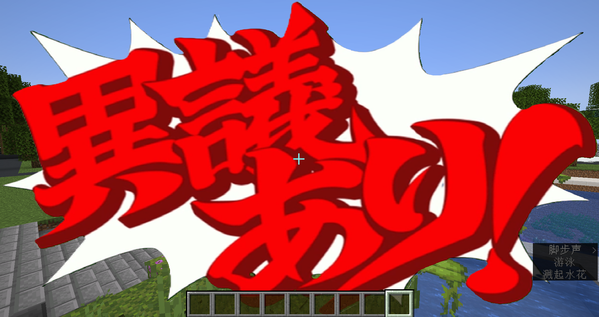
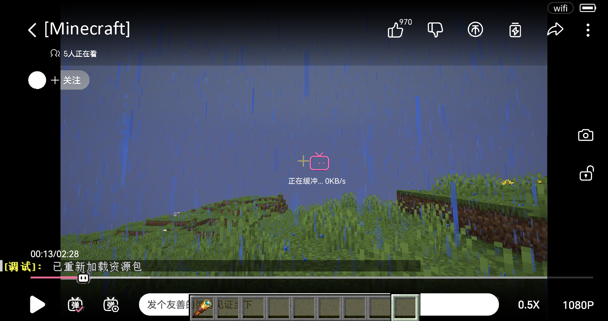
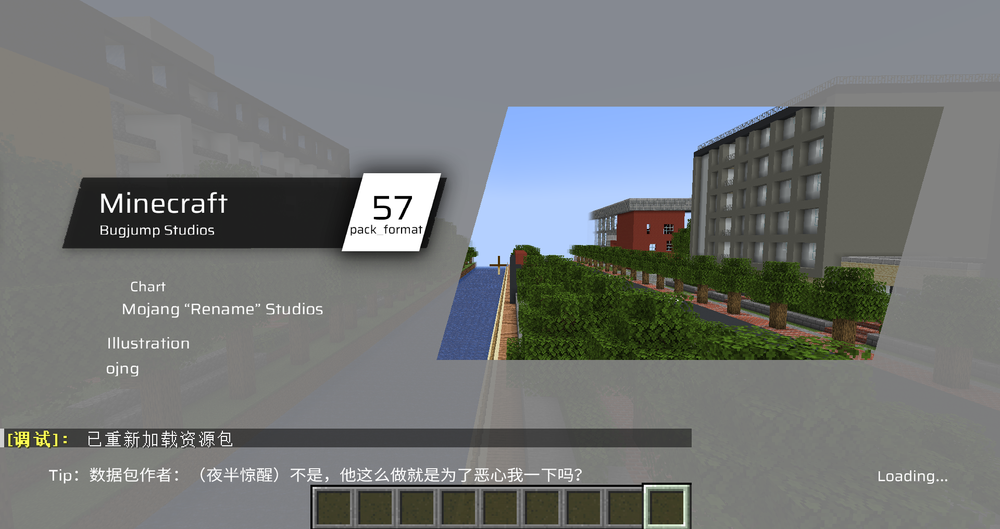
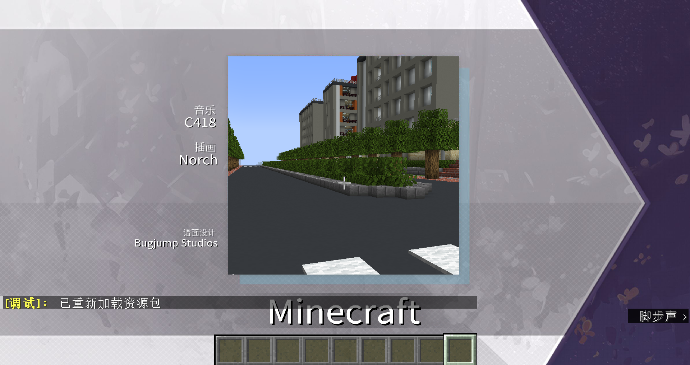
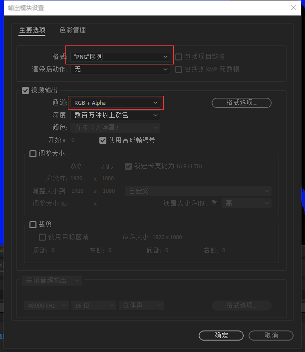
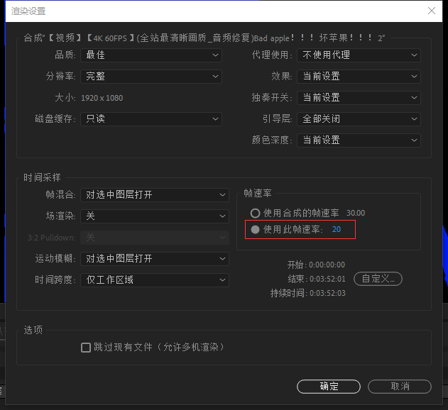
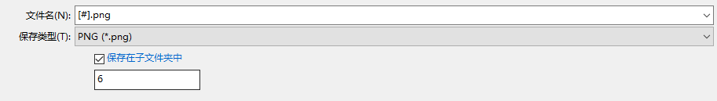

# 装备遮罩（camera_overlay）的一点研究
> by [CR_019](https://space.bilibili.com/85292644)  
> 本文亦发布于 [虚灵论坛](https://etis.vcsofficial.site/d/25) 和 [BiliBili专栏](https://www.bilibili.com/read/cv39806935/?spm_id_from=333.1387.0.0&opus_fallback=1)

版本：1.21.2-pre1
camera_overlay为equippable组件中的一个字段，可以引用资源包中任意一张图片的路径，使得玩家穿戴该物品在指定位置时，会在屏幕上显示遮罩。在原版中应用于雕刻的南瓜头。


不过很可惜，它并不很适合制作玩家ui。一方面是因为它会自动适应玩家窗口的分辨率，在极端情况下会拉伸的很厉害；另一方面它并不支持动图，且最多只能叠6层，如果需要做一些值类型的ui组件，还是建议使用其他方法，如title等，比如这个[title任意位置显示的库](https://www.bilibili.com/video/BV1AcvyeyECH)。

## 食用教程
例如：在`assets\what\textures\item`文件夹下有这么一张图片：

what.png  

我们使用如下指令获取一个将该图片作为遮罩的物品：
```mcfunction
give @s minecraft:firework_star[minecraft:equippable={camera_overlay:"what:item/what",slot:"mainhand"}]
```

这里我们将槽位设定在了主手，这样玩家拿着这个物品的时候，就会————


再配合equip_sound这个装备时播放声音的字段，就能产生很多幽默的效果：

https://www.bilibili.com/video/BV1rf2wYPEg9

当然，还有这些：


> 谢谢，已经在狂按esc了


> 一斤鸭梨！


> 没错，你卡了



> 唉音游吃


> 多少带点怨念

合集版：
https://www.bilibili.com/video/BV1WVCSY8ENW
https://www.bilibili.com/video/BV1PV2PYCE6B


## 让遮罩动起来！
当然，我们肯定不会满足于整这些活。 
有一个想法是很自然的：能不能放动图？  
但是在开头我们已经说了，遮罩不支持原版的动态纹理，只能是一张静态的图片。

但是如果和数据包结合呢？

我们知道，视频本质上是一系列图片依次播放，如果我们将视频拆解成一系列的图，使用数据包控制帧序列依次播放，就能达到动态的效果。  

说干就干，让我们找个视频来试试看。  
不如就……放个bad apple如何？

### 简单放个bad apple

#### 使用ae生成帧序列
首先我们需要得到视频的帧序列。可以使用after effects来生成。  
找到视频并下载下来，导入ae，为了体现遮罩，我们将视频的白色部分扣去（过程略），点击文件->导出->导出到渲染队列

先点击输出模块，将“格式”改为“PNG队列”，“通道”设为“RGB+Alpha”；

由于mc默认的刻速率为20帧每秒，因此在渲染设置里，将帧速率设置为20；

为方便调用，我们需要输出简单且规律的文件名；  
在输出选项中，将文件名设置为[#].png，这样可以输出递增的数字序列，方便调用。
#### 放进资源包
我最开始把生成的帧序列图片放进了textures/item路径下，然后……资源包爆炸了∑(;°Д°)  
不仅贴图错误，而且好几秒才能加载1帧；  
原因是为了加快访问速度，item和block文件夹下的图片会被游戏合并成图集预加载进内存，但由于帧序列图片过大且数量过多，使得游戏不堪重负。  

实际上，遮罩并不需要在加载资源包时预载，放在textures文件夹下的其他路径就可以了，比如misc什么的，任意路径都行。

#### 数据包序列控制
数据包这边，我们使用一个字段`dynamic_overlay`来标识动态遮罩名；

data/do/function/tick.mcfunction:
```mcfunction
execute as @a[tag=do] unless data entity @s Inventory[{Slot:103b}].components."minecraft:custom_data".dynamic_overlay at @s run function do:end
execute as @a[tag=do] if data entity @s Inventory[{Slot:103b}].components."minecraft:custom_data".dynamic_overlay at @s run function do:play
execute as @a[tag=!do] if data entity @s Inventory[{Slot:103b}].components."minecraft:custom_data".dynamic_overlay at @s run function do:start
```

该字段对应的动态遮罩名存储在minecraft:do存储的storage路径下，如：
```
data modify storage do storage.ba_480 set value {path:"ba:480",frames:4642,music:"ba:bad_apple",loop:0b}
```
其中"path"为资源包的遮罩帧序列路径；"frames"代表帧序列长度，"music"（可选）代表播放序列同时播放的音乐；"loop"为一个布尔值，代表是否循环；

当检测到玩家头戴带有`dynamic_overlay`字段的物品时，启动start函数，
data/do/function/start.mcfunction:
```
tag @s add do

data modify storage do temp set value {}
data modify storage do temp.key set from entity @s Inventory[{Slot:103b}].components."minecraft:custom_data".dynamic_overlay 
function do:init with storage do temp
```
data/do/function/init.mcfunction:
```
$data modify storage do temp.data set from storage do storage.$(key)
execute if data storage do temp.data run function do:init_
```
data/do/function/init_.mcfunction:
```
execute if data storage do temp.data.music run function do:music with storage do temp.data
scoreboard players set @s do_frame 0
execute store result score @s do_frame_max run data get storage do temp.data.frames
```

给玩家上一个tag标记，并将`dynamic_overlay`字段的值提取出来，去storage里寻找对应的数据，完成初始化，并播放音乐；

然后检测带有tag的玩家，执行play函数：

data/do/function/play.mcfunction:
```
data modify storage do temp set value {}
data modify storage do temp.key set from entity @s Inventory[{Slot:103b}].components."minecraft:custom_data".dynamic_overlay 
function do:play_ with storage do temp
```
data/do/function/play_.mcfunction:
```
$data modify storage do temp.data set from storage do storage.$(key)
execute if data storage do temp.data run function do:play__
```
data/do/function/play__.mcfunction:
```
execute store result storage do temp.data.cur_frame int 1 run scoreboard players get @s do_frame
execute unless data storage do temp.data.slot run data modify storage do temp.data.slot set value "head"
function do:item with storage do temp.data


execute if score @s do_frame < @s do_frame_max run scoreboard players add @s do_frame 1
execute if data storage do {temp:{data:{loop:1b}}} if score @s do_frame >= @s do_frame_max run function do:start
```
data/do/function/item.mcfunction:
```
$item modify entity @s armor.$(slot) [\
    {\
        "function": "set_components",\
        "components": {\
            "equippable":{\
                "camera_overlay": "$(path)/$(cur_frame)",\
                "slot": "$(slot)",\
                "equip_sound":{sound_id:"do:empty"}\
            }\
        }\
    }\
]
```

由于temp不是持久化的储存，因此需要每刻获取其值；  
这一部分的指令其实和start与init函数很像，区别在于这里是用于设置物品组件，且不需要初始化。  
每刻将当前帧信息+1；

item函数设置了一个内联的物品修饰器，path即为动态遮罩的路径；cur_frame则为当前帧。

当帧序列播放完后，检测loop是否为true，如果是则再次执行初始化函数，从头播放。

当然，如果检测到玩家把装备摘下来了，需要停止当前帧控制并把音乐停下来。

data/do/function/end.mcfunction:
```
tag @s remove do
stopsound @s
scoreboard players set @s do_frame_max 0
scoreboard players set @s do_frame 0
```

#### 大功告成！……？
将数据包和资源包加载进游戏，戴上显示器，确实可以看到在播放了。

但是遇到了一个问题：放到大概一半的时候，遮罩突然变成了紫黑块，再过一会游戏就闪退了。


排查了一下，发现在播放动态遮罩时，之前加载的图片并没有及时卸载，导致内存溢出。

无奈，只能将分辨率降低到480p重新导出，这样到放完也没有明显的内存增加的情况，能够用了。

这才有了这期视频。
## 小结
遮罩这个东西似乎并不能在地图开发上有特别多的应用，不过它本身而言还是非常有趣的，值得玩一玩，属于比较简单能做出比较好效果的东西了。