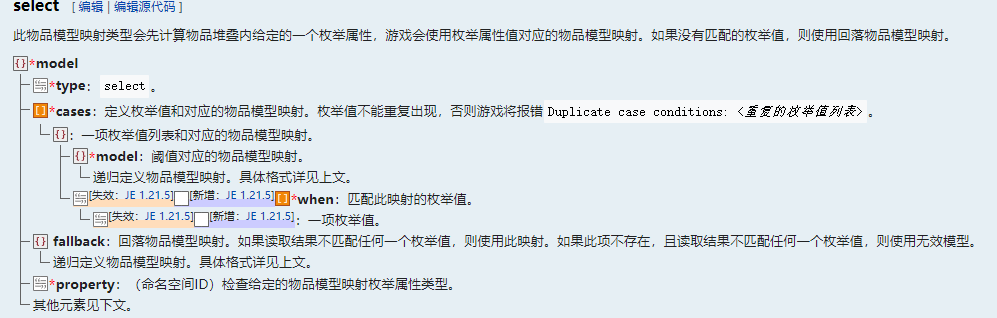

# 如何制作一只阿乔（模型篇）——兼谈1.21.4的物品模型映射系统
> by [CR_019](https://space.bilibili.com/85292644)  
> 本文亦发布于 [虚灵论坛](https://etis.vcsofficial.site/d/97) 和 [BiliBili专栏](https://www.bilibili.com/opus/1024906920604991522?spm_id_from=333.1387.0.0)

前些天我发布了[这个视频](https://www.bilibili.com/video/BV1Cok1YSER1/)，把原神的阿乔做进了mc里。可以发现，在主手、副手拿着时，以及使用时等状态下，它会呈现不同的造型。这是完全使用资源包实现的，用的就是1.21.4新增的物品模型映射系统。  

你问什么是物品模型映射？这就得从item_model组件讲起了……

# item_model组件和物品模型绑定

稍微熟悉资源包的同学都知道，mc的物品模型由几个部分组成：
- 首先是纹理贴图；
- 然后是模型文件，把纹理贴图组合成指定的模型；
- 最后游戏内的物品调用资源包的模型文件，把它渲染出来。

在旧版本，物品模型和物品ID是一一对应的，每个物品使用的模型是固定的，资源包无法更改。  
我们想要更改模型，只能在原版使用的物品模型下方添加**overrides**字段，把自定义的模型的路径引用到原版模型文件下方，根据物品的数据改变其应用的模型。

这样，我们基本解决了给数据包自定义物品加纹理的问题。不过这种做法也有一些缺点。因为overrides字段是会相互覆盖的，且只有物品直接引用的模型文件中，该字段才有效（此处即只有原版物品模型中生效）。
比如两个资源包修改了同一个物品的`overrides`，则只有上层的那一个会生效。

在1.21.2版本，mj引入了`item_model`物品组件，在该组件中指定模型的路径，可以直接使用这个模型来渲染物品。

现在，我们可以认为物品模型的绑定从在物品ID中硬编码，转变成了绑定于`item_model`物品组件（原版物品可以认为是拥有一个默认的`item_model`组件）。这样，我们可以不用关心原型物品，更加自由的使用自定义模型。

当然，这样写在自定义模型中的overrides字段也可以生效了。

于是，一个物品渲染的流程就变成了这样：

# 物品模型映射

现在，让我们把目光聚焦到这个override上。  

这个字段是模型文件的一部分，但是它本身不提供任何模型信息。它的作用是根据物品的 **数据/状态** 选择符合条件的模型。此外，只有物品直接引用的模型文件中的overrides生效，下层模型中的该字段不生效。

可以发现，这个字段很适合从模型文件中分离出来，做成一个条件控制结构，放在模型和物品渲染之间。

所以mojang就这么干了。这就是**物品模型映射**。

在新的模式里，模型文件回到了描述模型数据的定位上，选择模型的工作交给独立的物品模型映射完成。

物品模型映射是一个独立的文件，其位于和模型(`model`)、纹理(`texture`)平级的`items`文件夹下。现在`item_model`组件的路径指向了这个文件的路径。在映射文件中，根据指定的条件指向具体的模型路径。

以上面的magic:sapphire为例，现在指向`assets/magic/items/sapphire.json`文件。

# 写一个映射文件

## model型映射
> 主播主播，你讲的模型映射很高级，但是太绕了，有没有简单一点的教学？  
> 有的兄弟，有的，这样的教学，还有两个……  
> （消音）

上手实操的时候，最简单的方法，是拆包原版的资源包，看看mojang是怎么写的。  

如上是一个最简单的物品映射文件，取自原版的苹果物品。  
根标签下的model是固定的键名，它后面跟着的一个复合标签是一个**物品映射**。  
**注意到**其中的type键，它是模型映射的类型，这个键的值决定了标签里的其他字段。  
例子里，type的值是model，这是最基本的一种物品映射，表示指定一个物品模型进行渲染。  
下面的model键则用于指定模型的路径。  
那么我们依葫芦画瓢，定义一个自己的模型映射文件：  

这样，我们就完成了一个最简单的物品模型映射文件的编写：没有任何条件选择，在各种状态下都选择使用同一个模型。实际上，绝大多数的原版物品和自定义物品都只需要这样就够了。

## 复合物品模型映射

但是“伟大圣龙”库胡勒阿乔可不是“绝大多数”。拿在主手、副手、拿在鼠标光标上、阿乔的模型都有一些变化。这就涉及到条件选择了，也就是物品模型映射这个系统的真正作用所在。  
打开wiki，翻到物品模型映射页面（可以直接搜索），我们可以发现这样一张图：

这里的给出的项，就是所有可用的物品映射的类型，即填写在"type"里的值。  
wiki把提供的映射类型分为了复合物品模型映射和渲染物品映射。前者都包含一个或多个嵌套字段，在其中可以定义其他的物品映射；而后者，例如上面讨论的model类型，则不包含这种字段，是一个分支的结束。

> 我们在下面可以看到，实际上物品模型映射是一个树型结构，渲染模型映射可以看作叶节点，复合模型映射是非叶节点。  
> 另外，复合模型映射实际上承担了过去overrides的功能，不过这次mj给的谓词更多，能做的事情也更多了。

我们接下来要讨论的条件选择相关，就在上半部分的复合物品映射。
mojang提供了一系列检测物品状态的映射谓词，它们被分为了三个类别：布尔条件型(codition)、枚举型(select)、数值范围型(range_dispatch)。  
这三个类型的语法有一些差别，我们以制作阿乔需要的几个条件为例，分别讲解一下。  
### codition型映射
我想让我们的阿乔在被鼠标选中时露出惊讶的表情：

mj有提供相关的谓词:carried，它属于condition类型。

这一类映射的谓词是布尔类型的，有两个可选值：为真或为假；

property是需要检测的谓词，我们上面提到的carried就属于一个布尔谓词，所以把它填到这里：  

on_true和on_false是在谓词检测为真和为假的时候分别应用的模型，这两个键的值是一个嵌套的物品模型映射，可以直接是model，当然也可以在其中写其他的复合模型映射，进一步选择模型；

加入了这个条件，我们的模型映射文件现在长这样：

### select型映射
我们希望阿乔在主手时会说话，在副手时会跳舞，并且做好了对应的模型。

这一次，我们需要的映射谓词是display_context，属于select类型。

这一类型稍复杂些，可以结合后面的例子看。

这种谓词的值是枚举型，是有限的几个值；  
property仍然是需要检测的谓词，我们把display_context填在这里；  
cases是一个列表，其中每一项代表一个枚举值选择；  
列表中的一个项有两个键：
- when是匹配的枚举值，可以是值或者列表；
- model是符合上述枚举值时应用的模型，是一个嵌套模型映射。

此外还有一个fallback键，也是一个嵌套模型映射，在上述枚举值都不匹配的时候，使用这个映射。

渲染位置的可选值和模型文件里的display是一样的，这里就不列了，见下方的例子；

加入了这个条件，我们的映射文件变成了这样：

### range_dispatch型映射
阿乔的模型设计里并没有需要使用这一类型的谓词，不过还是介绍一下。

这种类型的格式和select类似，区别在于它的值是连续的数值。  
我们可以看到一样的property和fallback。  
多了一个scale属性，代表得到的值需要缩放的倍率。没有特殊需求的话，写1就好。  
select类型中的cases换成了entries，when变成了threshold，效果是相似的。一个小区别是threshold代表的是阈值，也就是所有大于等于这个值、小于等于下一个阈值的所有值都会使用这个项内的模型。  

这里给出一个根据指南针的指向值选择朝向的模型映射样例(倍率乘以360以方便角度计算)：

## composite型映射

到这里，我们已经接近做出一个完整的阿乔了。不过怎么能少了招牌的拽尾巴呢？:)

注意看，这只像素龙叫阿乔，它的尾巴和身体之间偏转了一个角度。  
这种模型，并非使用一张纹理可以实现。那么应该怎么做呢？  
回到上面的wiki图：

  

我们还差一个**composite类型**的复合物品模型映射没有讲。而这种类型，就是来解决我们上面提出的问题的。  
composite是一种特殊的复合物品模型映射。它不像其他三个那样，根据条件选择一个指定的模型，而是将其下方的所有模型合并到一起。  
当然，使用起来还是很简单的。

对于这只阿乔而言，它的模型分为了两个部分，垂下来的尾巴和挣扎的身体。

    

在模型的显示上，我们把身体部分旋转了一个角度；  
然后在物品模型映射文件里，我们只需要把这两个模型分别写进model列表的项里即可。  

我们希望在使用（即按住右键）的时候，调用这个模型，那么，在我们的映射文件的最外层，套一个上面讨论过的condition类型映射，再把这个拽尾巴的复合映射放入on_true里面。于是，我们得到了最后的文件：  

`assets/pet/items/dragon.json`：

乍看之下有些复杂，但是经过我们的拆解，是不是其实还挺简单的？  
我们把这个资源包安装上以后，使用pet:dragon这个路径调用改模型映射，就可以看到我们的伟大圣龙在mc游戏内的样子了。  
借助动态纹理和条件映射，即便不安装数据包，这样实现的阿乔也足够灵动了。 

# 小结

> 到此，我们介绍完了常用的模型映射的类型。可以发现，复合物品模型映射都带有一个或多个映射类型的键，可以在其中继续嵌套地定义物品模型映射。在层层条件选择后，以渲染物品模型映射类型结束这个分支。我们把这种选择关系用图形的形式写出来，这其实很接近树的结构。  
> 

参考链接： 
- [物品模型映射 - Minecraft Wiki](https://zh.minecraft.wiki/w/%E6%A8%A1%E5%9E%8B#%E7%89%A9%E5%93%81%E6%A8%A1%E5%9E%8B%E6%98%A0%E5%B0%84)