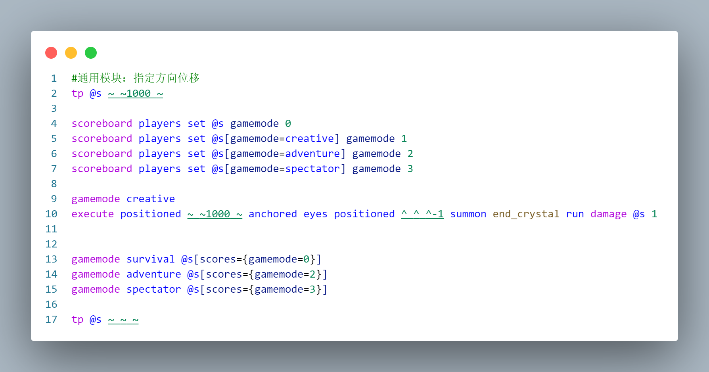
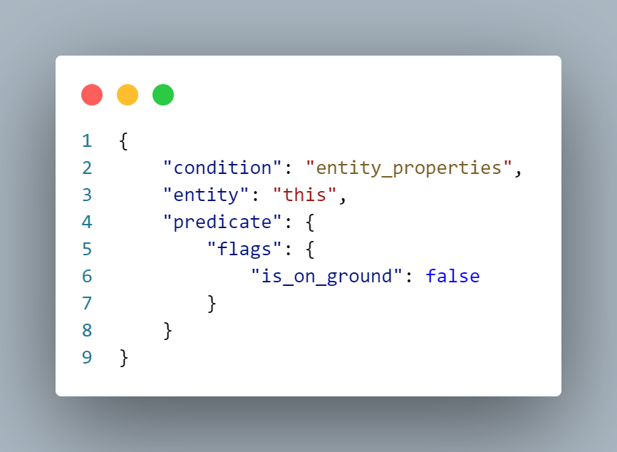
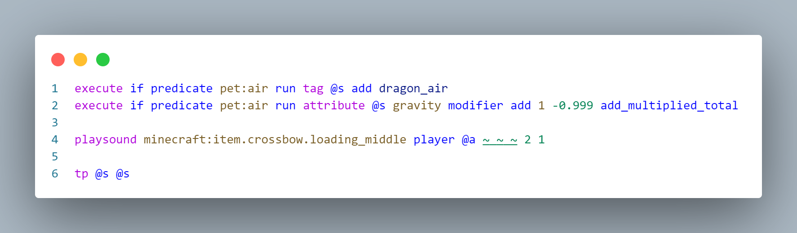

# 如何制作一只阿乔（钩锁篇）
> by [CR_019](https://space.bilibili.com/85292644)  
> 本文亦发布于 [虚灵论坛](https://etis.vcsofficial.site/d/98) 和 [BiliBili专栏](https://www.bilibili.com/opus/1025312318276239363?spm_id_from=333.1387.0.0)

比起模型部分，钩锁反而是相对来说简单的部分了。  
当然，这篇内容需要一定的数据包基础。不会像上一篇那样讲的很仔细。  

# 正片
## 模块划分
钩锁这个功能可以简单分为几个模块：使用和瞄准（右键触发），触发发射（推动玩家），空中二段瞄准，冷却处理。接下来，就是分别实现这些模块即可。  

## 瞄准

瞄准有现成的方案。这个方法其实我在第三期[《常用右键检测》](/resources/dust/3/常用右键检测.md)里讲解过了。  
就是使用consumable组件赋予物品使用的能力，把长按松发和长按蓄力结合起来使用，均链接到触发推动的函数上。  
在这里就不详细介绍了。

## 推动玩家
推动玩家其实也有现成的解决方案。  
我们详细描述一下我们的需求：**需要在触发时，将玩家向视角指向的方向赋予一段动量。**  

我们知道，玩家是不能修改nbt的。因此我们不能通过修改motion的方法移动玩家。  
而tp是立即生效，也不能使用。  
因此我们想到，可以使用爆炸产生的冲击，赋予玩家动量。  

思路确定，接下来的事情就是逐一处理遇到的问题。  
- 如何制造爆炸？
  - 有几个备选：苦力怕、tnt（实体）、末影水晶，都能提供瞬间的爆炸；
- 怎么避免爆炸破坏地形和伤害周围实体？
  - 把玩家和提供爆炸的实体tp到高空，爆炸后再瞬间tp回来。
  - 但是，苦力怕和tnt由于是nbt控制，会在1tick的命令全部执行完毕后才爆炸，所以会导致玩家回到地面，苦力怕在天上爆炸，无事发生。
  - 所以，我们确定了使用的实体：末影水晶。只要给它一点伤害就可以立刻爆炸。
- 怎么避免玩家受到伤害？
  - 爆炸前切换为创造模式，然后切换回来。
  - 因此需要建立一个计分板，记录当前的游戏模式。
- 怎么面向指定方向爆炸？
  - 使用局部坐标(^ ^ ^-1) 在玩家视角的背后生成爆炸物，就可以向视角方向推动玩家。

那么我们就可以把这个模块写出来了：

`pet/function/misc/motion.mcfunction`

当然可以多生成几个末影水晶，可以推的更远。

## 空中二段瞄准

众所周知，在纳塔地区，基尼奇可以借助阿乔在空中进行二段钩锁。mc世界虽然不是纳塔地区，但是我还是很想实现这种效果，所以我们就来尝试一下。  

在这种情况下，如果玩家在地面触发钩锁，不会立即进入冷却，以方便在空中进行二段弹射；而在空中触发，就直接进入冷却了。  
因此我们需要一个谓词，区分玩家是否在地上：

`pet/predicate/air.json`

另外，空中弹射还有一个问题需要解决：拉住阿乔的时候，玩家应当悬停在空中。  
这个目前没有特别好的解决方法，以下是我实现的一个比较接近的效果的方法，供大家参考：

首先，在1.21.4，使用 /attribute 指令可以修改玩家的重力；  
然后，将玩家tp到自身所在位置可以重置玩家的动量；  
那么理论上，在玩家拉住阿乔的瞬间使用这两个命令可以让玩家悬停在空中。  

不过实际效果是玩家会缓慢下落，不过不是很影响瞄准，我也就将就了。

`pet/function/dragon/effects/check_.mcfunction`

以上命令在空中拉住阿乔的瞬间会触发一次。

## 冷却处理

阿乔在以下情形下会进入冷却：
- 地面发射后，落地；
- 在空中进行二段发射。

### 冷却计算
我们使用一个计分板来处理冷却。  
先写一个使其分数递减的命令；  
当需要进入冷却的时候，就将该计分板设定为需要冷却的刻数。  
在tick函数里加入判断：当计分板不为0，且玩家在地面时，进入冷却；  
在触发弹射的函数里加入判断：如果在地面释放，则设定一定的冷却值；如果空中释放，则设定更多冷却值并直接进入冷却。  
最后，如果计分板归零，玩家的阿乔仍处于禁用状态，就恢复正常状态。

### 物品切换
进入冷却的做法很简单，把“阿乔”换成“生气的阿乔”，“生气的阿乔”没有consumable组件，也就不能使用，同时生气的表情也很莫名的符合龙设（  
因此，进入冷却和恢复，本质上是两个物品来回切换。  
进入冷却的时候比较好处理，因为阿乔一定在手上；但是恢复的时候，玩家的手上不一定拿着这个物品。这里介绍两种处理这种问题的方法：  
- 比较稳定的办法是，遍历背包或者使用宏，精准找到我们需要替换的物品，把它替换掉：因为我之前写了一个宏方法查找背包物品的前置，我就直接使用了这个方法；  
- 比较省事，效果也尚可的方法是，只在玩家手上拿着阿乔的时候判断冷却条件，这样不影响使用。不过需要保证标记阿乔状态的tag和物品同步，或者直接检测物品的数据。

## 其他处理
到此，我们的阿乔已经基本完善。剩下的是一些锦上添花的效果。

### 摔落保护
这个阿乔可以把玩家带到很高的地方，因此我们肯定不希望落地的时候摔死。~~（阿乔：未必）~~

我这边使用了偷懒的方法，给了玩家5秒的全抗性，凑合一下吧。 :)

### 瞄准效果

在视频里，我们可以发现瞄准的时候会叠一层遮罩。这是通过装备遮罩实现的，可以看[这期教程](/resources/dust/2/2-装备遮罩.md)；

我们事先准备好遮罩的图片，这里我是模仿基尼奇使用钩锁时的遮罩画的；
在检测到玩家使用阿乔的时候，就给阿乔的装备数据里加入遮罩；当检测到玩家不再使用时，将其去除。

---

那么以上就是制作阿乔的钩锁功能的全部思路。至于具体的函数实现，就直接拆包去看吧，肯定比我在这里贴大段代码要易懂。